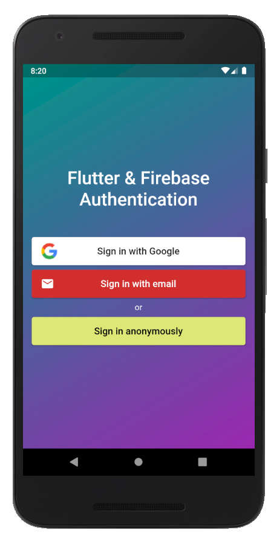

# FlutterBase

Flutter and Firebase authentication flow.

## FlutterBase_UI

This branch contains the UI part of our Flutter FIrebase authentication application. And this UI is configured with [Firebase](https://console.firebase.google.com/).

## Preview

<table><tr>
<td style="text-align: center">
 
 </td>
<td style="text-align: center">
 
 </tr></table>
 

 
 ## Connect Flutter with Firebase
 
 Steps to connect with [Firebase](https://console.firebase.google.com/):
 
- Create a new project with the Firebase console.
- Add Android apps in the Firebase project settings.
- Use the package (for this project it is `com.example.flutterbase`) and also a SHA-1 certificate fingerprint is also needed for Google sign-in.
- then, download and copy `google-services.json` into `android/app`
- and now a little more configuration is needed, for this [see documentation](https://firebase.google.com/docs/android/setup#add-config-file)

_Note: To know how to connect a Flutter project with the backend service Firebase in details, click [here](https://www.instagram.com/p/CDTe8gEga4j/?utm_source=ig_web_copy_link)  😉_
